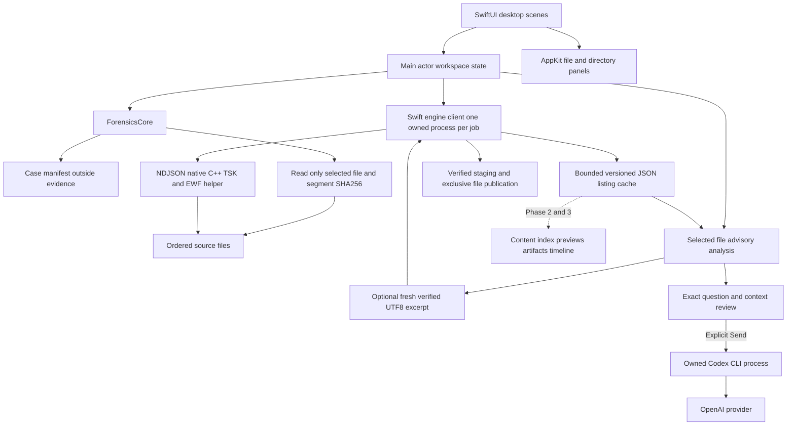

# สถาปัตยกรรม NativeForensics

NativeForensics เป็น evidence workbench สำหรับ macOS ที่แยก desktop state, case persistence และ native analysis jobs ออกจากกัน มี Phase 0 สำหรับเคสและ selected-file SHA-256 และ Phase 1 ชุดแรกสำหรับ RAW/EWF filesystem listing/extraction แล้ว Phase 1 ยังอยู่ระหว่างตรวจ coverage; carving, content index และ artifact parsing เป็นงานระยะถัดไป

## การไหลของข้อมูล

เส้นทึบคือ components ที่มีใน code; เส้นประคือส่วนที่ยังต้องสร้าง Helper ใช้ audited TSK 4.15.0 lineage ตาม [ADR 001](adr/0001-native-foundation.md) แยก process ตาม [ADR 002](adr/0002-engine-process-boundary.md) และสัญญาจริงใน [Engine protocol](ENGINE-PROTOCOL.md) การมี implementation ไม่ได้แทน acceptance coverage ใน [Validation](VALIDATION.md)

## Desktop และ core

`Sources/NativeForensics` เป็น desktop app โดยแยก App, Views, Stores และ Services SwiftUI จัดการ navigation, toolbar และ selected case/evidence ส่วน narrow AppKit services จัดการ file/directory panels เพื่อให้เข้ากับ macOS Desktop store อัปเดตบน main actor และส่งงานอ่านที่ยาวไป background task

`Sources/ForensicsCore` เป็น Swift core สำหรับ case/evidence records, versioned manifest persistence, read-only inspection, `EngineClient` และ `EngineResultStore` Core ไม่ import UI frameworks และทดสอบได้ด้วย synthetic temporary files/mock helper; native integration แยกเป็น opt-in tests

Case root เป็น `.nativecase` bundle ที่เลือกแยกจาก evidence `manifest.json` เก็บ selected-file records และ `filesystem/<evidence-id>.json` เก็บ analysis cache แยก schema การเพิ่ม evidence เก็บ reference/hash โดยไม่ย้ายหรือแก้ source Extraction ใช้ owned staging ใน validated destination ก่อน publish เป็นไฟล์ใหม่

## Native helper และ lifecycle

`NativeEngine/NFTSKEngine.cpp` เรียก TSK C/C++ APIs โดยตรง ใช้ static `libtsk` 4.15.0 และ `libewf` 20240506 พร้อม patches สำหรับ exFAT offsets, EWF read API/explicit segments และ FAT dates ถึงปี 2107 บนระบบ 64-bit รายการและ checksums อยู่ใน `NativeEngine/dependencies.json` ส่วน JSON ใช้ pinned nlohmann/json header `.app` รวม `Contents/Helpers/NFTSKEngine`; dynamic closure ของ build receipt มีเฉพาะ macOS system libraries

Swift client เปิด helper หนึ่ง process ต่อหนึ่ง request ไม่มี shell และใช้ poll loop อ่าน stdout/stderr พร้อมกัน Protocol v1 ตรวจ hello, job ID, sequence, frames และ terminal status ต้องมี complete result และ exit 0 จึงนับ success Partial มี warnings และไม่ถูกแปลงเป็น completed; crash/protocol failure/cancellation ไม่เขียนทับ prior historical cache

NDJSON frame จำกัด 1 MiB, file batches ไม่เกิน 128 rows, listing ceiling 50,000 records และ serialized response/cache ceiling 64 MiB พร้อม bounded stderr capture Limits ทำให้ได้ explicit partial/failure แทน silent truncation ตัวเลขนี้จำกัด serialized data ไม่ใช่ hard RSS cap หรือ measured peak RAM

Cancellation เริ่มจาก protocol request และตามด้วย SIGTERM/SIGKILL เฉพาะ owned helper PID หลัง grace periods Client มี startup/inactivity deadlines และตรวจ source identity ที่ held descriptors/canonical paths ก่อนและหลังงาน ยังไม่มี parallel worker scheduler ในแอป มี [helper concurrency experiment 1/2/4](BENCHMARKS.md) แยกจาก Swift/GUI สำหรับใช้ตัดสินใจงานต่อไป

## Hash scopes และ split images

| Record | Scope |
|---|---|
| `EvidenceRecord.sha256` | `selected-file-bytes`: bytes ของไฟล์ที่เลือกใน Phase 0 |
| `EnumerationResult.sourceFileHashes` | SHA-256 แยกแต่ละไฟล์ใน ordered `sourcePaths` set |
| `EngineImageMetadata.logicalSha256` | `logical-image-bytes`: image bytes หลัง decode/decompression; requested by default |
| `ExtractionResult.sha256` | `extracted-file-bytes`: bytes ของ output ที่ helper เขียนและ Swift ตรวจซ้ำ |

Selected E01 segment hash ไม่แทน logical image หรือ segment completeness UI ให้เลือก additional segments และ reorder/remove เอง ไม่มี sibling-file discovery Helper ตรวจ intrinsic EWF sequence, read-only libewf corruption/completeness preflight และ actual TSK-opened paths หากพบ segment ที่ไม่ได้ระบุหรือ order ไม่ตรงให้ปฏิเสธ

ก่อน enumerate/extract Swift hash ทุก input segment และเก็บ source identities Helper/Swift ตรวจ identity หลังงาน; UI ตรวจ selected evidence SHA-256 ก่อน/หลังเทียบ manifest อีกชั้น ก่อน extraction ตรวจ expected hashes ของทุก cached ordered segment Source ที่เปลี่ยนต้องได้ error การอ่าน read-only ไม่ป้องกัน external writers จึงไม่ใช่ snapshot guarantee

## Filesystem results และ timestamps

Helper อ่าน filesystem ที่ byte offset zero หรือใน MBR/GPT partitions เก็บ file paths, allocated/deleted flags, metadata address, sizes และ NTFS attributes/data streams ค่า timestamp ส่งเป็น integer Unix seconds และ nanoseconds โดยไม่แปลงผ่าน floating point Evidence timezone เป็น IANA option ที่ตั้งภายใน helper process; display timezone เปลี่ยนการนำเสนอเท่านั้น

Valid per-entry exFAT offsets ใช้ patch ที่ pinned ไว้ แต่ unknown-offset/DST/invalid-date corpus และ richer timestamp provenance ยังเป็น acceptance งานต่อไป TSK adapter นี้ไม่มี UDF ต้องมี adapter แยก และปฏิเสธ APFS/encrypted filesystems ไว้สำหรับ Phase 3 Generic auto-detection ไม่ทำให้ filesystem ทุกชนิดเป็น validated capability

Filesystem listing และ extraction receipt เป็นคนละ result type Deleted filesystem entry หมายถึง metadata flag ไม่รับรอง intact content หรือ file recovery completeness Carved candidates/artifacts จะเป็น models เพิ่มต่างหากใน Phase 2/3

## Storage และ indexing

`CaseStore` และ `EngineResultStore` ใช้ atomic/exclusive publication, case lock และ schema/scope checks Phase 1 cache เป็น bounded versioned JSON พร้อม options, engine version, patch digest, ordered inputs/hashes, volumes, files, warnings และ completed/partial status การเปิด cache เป็น historical listing ไม่อ่าน source ใหม่จน analyze/extract

Extraction เขียนเฉพาะไฟล์ staging ใหม่ Swift ตรวจ output bytes/size/hash เทียบ helper receipt แล้วใช้ exclusive rename เพื่อ publish Destination ที่มีอยู่และ input sources ไม่ถูกเขียนทับ หาก post-extraction UI source verification ไม่ครบ receipt จะแสดง unverified

Phase 2 เลือก document text extraction และ content indexing หลังทดลอง workload ที่กำหนดได้ จะพิจารณา SQLite FTS5 สำหรับ index เบื้องต้นเทียบกับข้อกำหนดภาษาไทย, Unicode, prefix/phrase/regex และ incremental updates การเลือก database/index ไม่ได้อาศัย overhead ของ Solr บนโปรแกรมเดิมเพียงอย่างเดียว

## Evidence safety และ privacy

- เปิด source สำหรับอ่านเท่านั้น ไม่มี repair, mount read-write หรือ extraction ลง source
- ตรวจ path overlap, symlink และ source identity ก่อนเขียน generated data; ใช้ destination validation อีกครั้งก่อน publish export
- Persist output แบบ atomic และรักษาข้อมูลเคสเมื่อ write ไม่สำเร็จ
- ส่ง cancellation ไปเฉพาะ tasks/processes ที่ app สร้าง เก็บ partial state และล้างเฉพาะ scratch ของ job นั้น
- Engine/case/hash/preview preparation ทำงานในเครื่อง การใช้ Analyze with Codex ส่งคำถามกับ metadata และ optional bounded UTF-8 excerpt ไปยัง OpenAI หลังผู้ใช้ทบทวน exact prompt และกด Send; ไม่ส่ง raw disk image และไม่ส่งอัตโนมัติ การเปิด preview/เตรียม metadata ไม่ใช่การอนุญาต upload ดู disclosure, CLI permissions และข้อจำกัดใน [Codex analysis](CODEX-ANALYSIS.md)
- Build-time source downloads แยกจาก evidence workflow Logs ที่นำออกจากเครื่องต้อง redact paths, filenames และ secrets
- Git เก็บโค้ดและ synthetic fixtures เท่านั้น Runtime case manifests สามารถมี local references ที่จำเป็นต่อการ reopen แต่ไม่ถูกนำขึ้น repository

## Performance ที่ต้องวัด

ก่อน optimize ต้องแยกเวลาของ startup, image read/decompression, filesystem enumeration, hashing, text extraction, index write และ UI rendering ใช้ bounded streaming, backpressure และ measured worker policy; ให้ UI แสดง progress โดยไม่ redraw ต่อทุกไฟล์

Filesystem path search ใช้ immutable bounded snapshot ของ entries เดิม สแกน Foundation Unicode predicate รอบเดียวใน cancellable detached task หลัง debounce 120 ms การ publish ตรวจ generation, case ID/URL, evidence และ query; observers ของ query/evidence อยู่ใน store จึงไม่ขึ้นกับ view lifecycle Empty query ใช้ array copy-on-write และ dictionary lookup index สร้างโดย reserve/insert โดยไม่สร้าง temporary tuple array ตารางแสดง ArraySlice สูงสุด 100 entries ต่อหน้า พร้อม exact match/page counts; pagination เป็น presentation limit ไม่ลด saved records หรือ search scope

มี native helper และ listing/extraction UI แล้ว แต่ยังไม่มี matched full-app performance claim หรือ M5 measurements ทุกระยะมี correctness gate ของตัวเองตาม [roadmap](ROADMAP.md), [Validation](VALIDATION.md) และ [benchmark method](BENCHMARKS.md)

## Build provenance และ distribution

Build แรกต้องดาวน์โหลด checksum-pinned source ตาม [dependency specification](../NativeEngine/dependencies.json) แล้ว compile ผ่าน installed Xcode toolchain Cache จริงอยู่ใต้ ignored `.engine/` พร้อม actual manifest, source archives, notices และ `.engine/relink/` artifacts ของ static components การ build ซ้ำใช้ verified cache Runtime ไม่ต้องใช้ Homebrew/Java/Solr

Development bundle ใช้ ad-hoc signing ก่อนแจก binary ต้องมี corresponding source/patches, runnable relink recipe, license notices และ clean-machine signing/notarization checks ตาม [Third party notices](../THIRD_PARTY_NOTICES.md) การมี local cache ไม่เท่ากับ distribution package ที่ครบ
