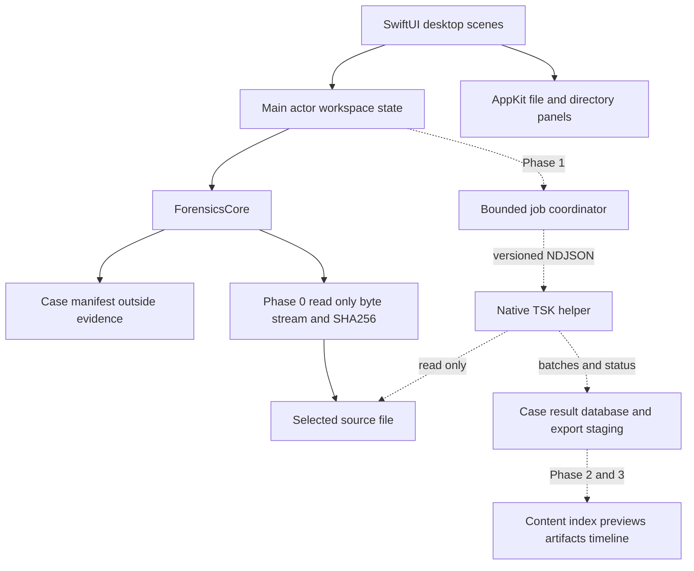

# สถาปัตยกรรม NativeForensics

NativeForensics เป็น evidence workbench สำหรับ macOS ที่แยก desktop state, case persistence และ native analysis jobs ออกจากกัน Phase 0 เริ่มจากสร้างและเปิดเคสเดิม พร้อมตรวจ selected file แบบ read-only และ SHA-256 streaming ส่วน filesystem enumeration, recovery, content search และ artifact parsing เป็นงานในระยะถัดไป

## การไหลของข้อมูล

เส้นทึบคือ foundation scope; เส้นประคือ components ที่ยังต้องสร้าง Helper ใช้ audited TSK 4.15.0 lineage ตาม [ADR 001](adr/0001-native-foundation.md) และแยก process ตาม [ADR 002](adr/0002-engine-process-boundary.md)

## Desktop และ core

`Sources/NativeForensics` เป็น desktop app โดยแยก App, Views, Stores และ Services SwiftUI จัดการ navigation, toolbar และ selected case/evidence ส่วน narrow AppKit services จัดการ file/directory panels เพื่อให้เข้ากับ macOS Desktop store อัปเดตบน main actor และส่งงานอ่านที่ยาวไป background task

`Sources/ForensicsCore` เป็น pure Swift foundation สำหรับ case/evidence records, versioned manifest persistence และ read-only inspection Core ไม่ import UI frameworks และทดสอบได้ด้วย synthetic temporary files

Case root เป็น `.nativecase` bundle ที่เลือกแยกจาก evidence Phase 0 บันทึก metadata ใน `manifest.json` Generated indexes, scratch files และ exports ในระยะถัดไปอยู่ใต้ case root หรือ dedicated scratch ที่ app สร้างเอง การเพิ่ม evidence เก็บ reference และผลตรวจโดยไม่ย้ายหรือแก้ไข source

## ความหมายของ hash ใน Phase 0

SHA-256 ใน Phase 0 คือ hash ของ bytes ใน selected file ตั้งแต่ byte แรกถึง EOF หากเลือก `.E01` เพียงหนึ่ง segment ค่านี้คือ hash ของ container segment นั้น ไม่ใช่ hash ของ logical/decompressed disk image และไม่ใช่หลักฐานว่ารวบรวม split image ครบ

Phase 0 เก็บ digest ในฟิลด์ `sha256` และ hash scope `selected-file-bytes` พร้อม file size โดยเพิ่ม evidence record เฉพาะเมื่อ inspection สำเร็จ งานที่ cancelled หรืออ่านผิดพลาดไม่มี completed record Source ที่ size/metadata เปลี่ยนระหว่างตรวจต้องรายงาน source-changed และไม่ทำให้ผลดูสมบูรณ์ การอ่านไฟล์แบบ read-only ไม่รับรองว่าโปรแกรมอื่นจะไม่เปลี่ยน source ระหว่างงาน

Logical image hashing จะเพิ่มพร้อม container-aware adapter ใน Phase 1 โดยแยก records จาก container hashes Extraction ในภายหลังจะมี hash ของ exported file bytes และ provenance ถึง source image/volume/file record

## โมเดลผลลัพธ์ในระยะถัดไป

Result model แยก evidence source, volume, filesystem object, extracted bytes, carved candidate และ artifact ไม่รวมทุกชนิดไว้ในรายการไฟล์ที่มีความหมายเดียวกัน โดยเฉพาะ carved candidate ไม่ถูกระบุว่าเป็น deleted file โดยไม่มี allocation/provenance สนับสนุน

Timestamp record เก็บ raw representation, normalized instant ถ้าทราบ, filesystem precision, source timezone/offset และ assumption เมื่อ unknown Valid per-entry exFAT offset ต้องไม่ถูก host timezone แทนที่ ส่วน FAT local time และ classic syslog ต้องใช้ evidence timezone ที่ระบุและเปิดเผย ambiguity

Job records มี started/completed times, component versions, parameters, terminal status, warnings และ partial stages Data ที่ถูกอ่านได้ก่อน failure คงไว้พร้อม status ที่ถูกต้อง ไม่ใช้ DB มีอยู่หรือ process exit 0 เป็นตัวแทนความสำเร็จ

## Storage และ indexing

Phase 0 ใช้ versioned JSON manifest และ atomic persistence ที่ตรวจ error ได้ SQLite result store และ schema migrations เป็น Phase 1 เป้าหมายของ migration คือ preserved source identifiers, durable partial state และการเปิดเคสเดิมอย่างชัดเจน

Phase 2 เลือก document text extraction และ content indexing หลังทดลอง workload ที่กำหนดได้ จะพิจารณา SQLite FTS5 สำหรับ index เบื้องต้นเทียบกับข้อกำหนดภาษาไทย, Unicode, prefix/phrase/regex และ incremental updates การเลือก database/index ไม่ได้อาศัย overhead ของ Solr บนโปรแกรมเดิมเพียงอย่างเดียว

## Evidence safety และ privacy

- เปิด source สำหรับอ่านเท่านั้น ไม่มี repair, mount read-write หรือ extraction ลง source
- ตรวจ path overlap, symlink และ source identity ก่อนเขียน generated data; ใช้ destination validation อีกครั้งก่อน publish export
- Persist output แบบ atomic และรักษาข้อมูลเคสเมื่อ write ไม่สำเร็จ
- ส่ง cancellation ไปเฉพาะ tasks/processes ที่ app สร้าง เก็บ partial state และล้างเฉพาะ scratch ของ job นั้น
- ไม่มี telemetry/network upload ใน foundation; logs ของงานภายหลังต้อง redact paths, filenames และ secrets ตามการส่งออกที่ผู้ใช้เลือก
- Git เก็บโค้ดและ synthetic fixtures เท่านั้น Runtime case manifests สามารถมี local references ที่จำเป็นต่อการ reopen แต่ไม่ถูกนำขึ้น repository

## Performance ที่ต้องวัด

ก่อน optimize ต้องแยกเวลาของ startup, image read/decompression, filesystem enumeration, hashing, text extraction, index write และ UI rendering ใช้ bounded streaming, backpressure และ measured worker policy; ให้ UI แสดง progress โดยไม่ redraw ต่อทุกไฟล์

การผ่าน read-only hashing foundation ไม่รับรอง TSK helper หรือ forensic module ใหม่ ทุกระยะมี correctness gate ของตัวเองตาม [roadmap](ROADMAP.md) และ [benchmark method](BENCHMARKS.md)
